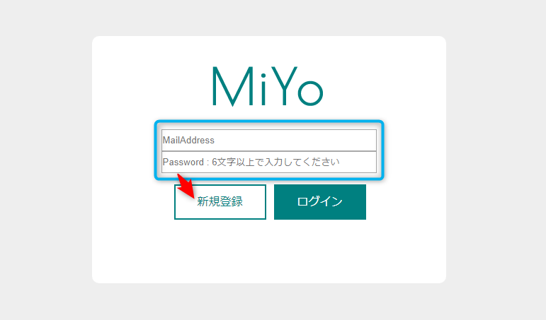
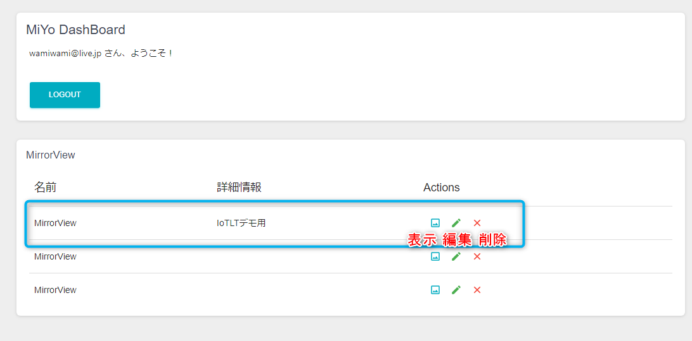
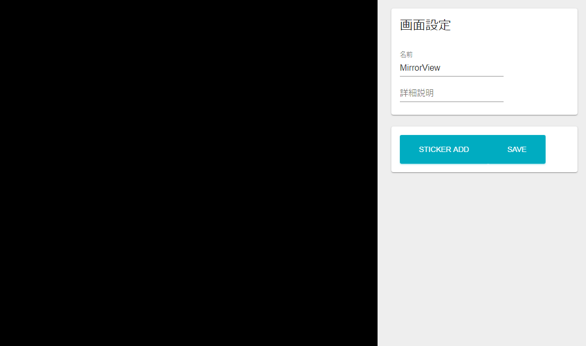
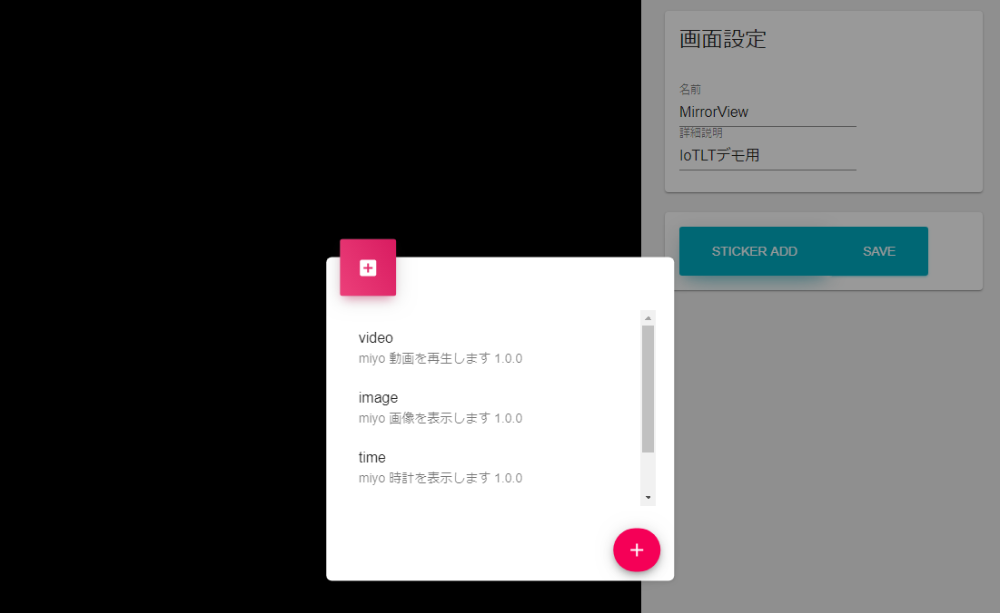
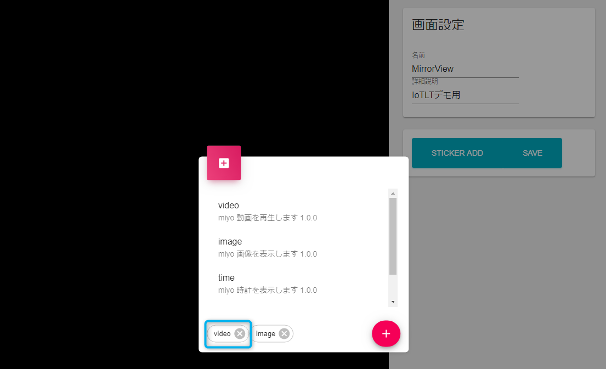
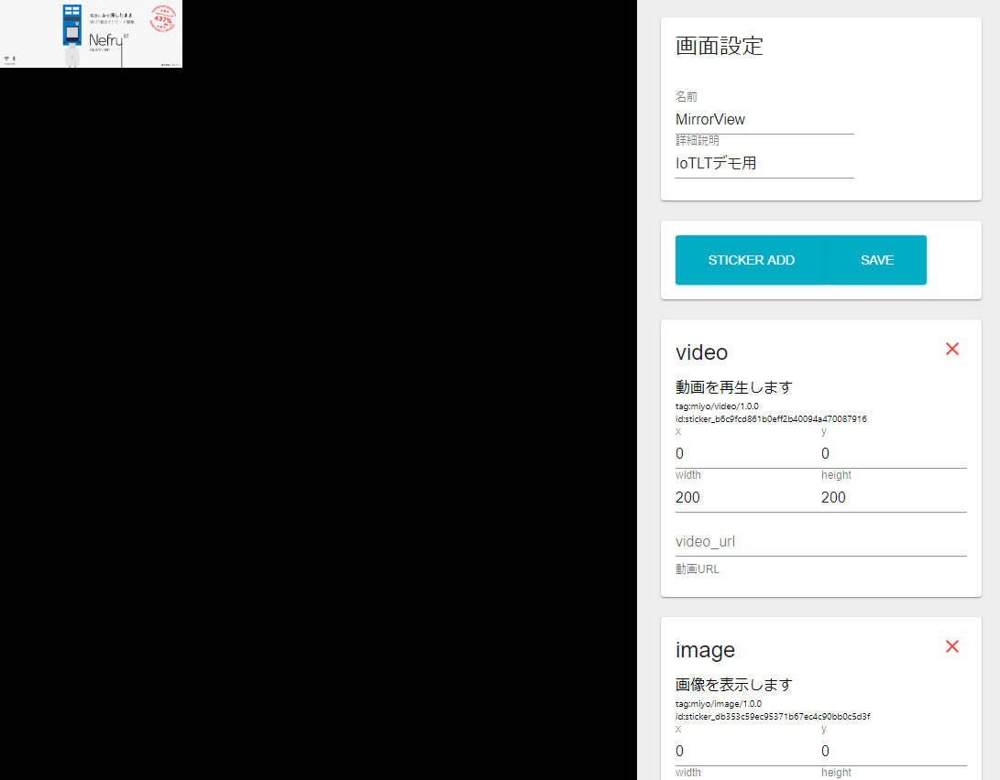
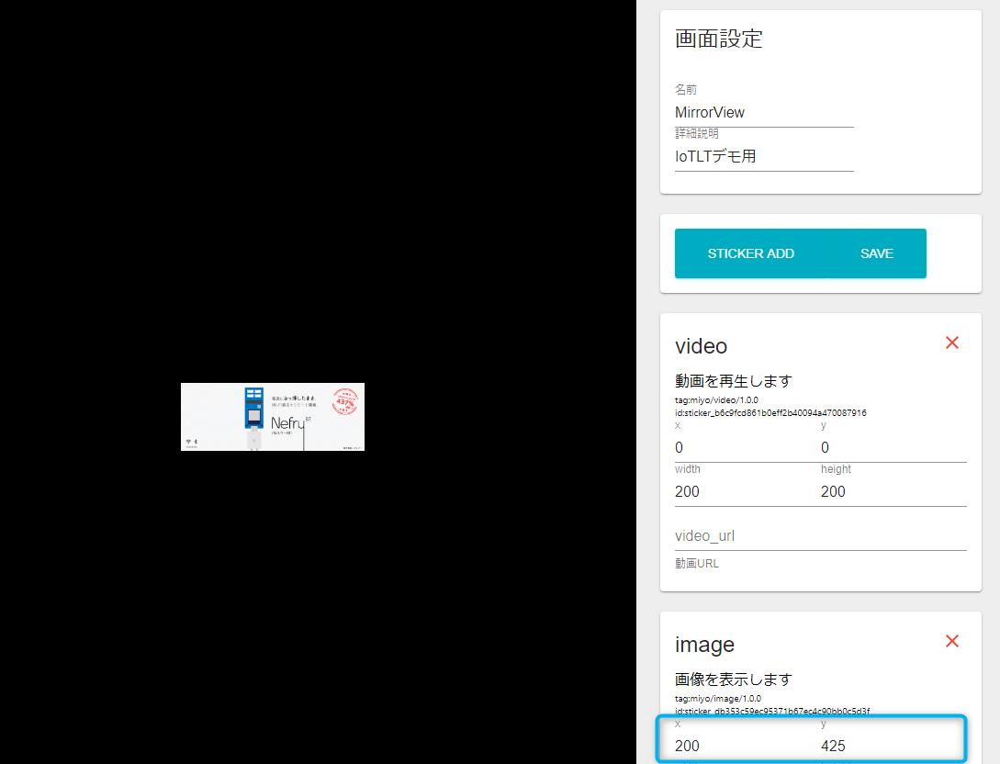
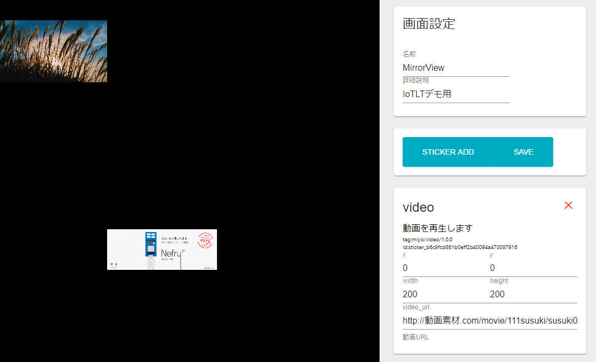

# MiYo Webアプリ使い方

## アカウント作成

MiYoのWebアプリを使用するためにはアカウントの作成が必須です。

MiYoアプリURL : [https://miyo.nefry.studio/](https://miyo.nefry.studio/)

メールアドレスと6文字以上のパスワードを入力し、「新規登録」を選択し、アカウントを作成します。

## 一覧画面紹介

アカウントの作成に成功すると、次のような一覧画面が表示されます。

この一覧画面から様々な操作ができます。ログアウトやMiYoに表示する画面を編集できます。

基本的に3つの画面を作成できます。青枠で囲まれたものが一つの画面単位で、それぞれのアイコンで表示、編集、削除を行えます。順に説明していきます。

表示は、MiYoに表示するスマートフォンにフルスクリーンで表示する際に使用します。

編集は、MiYoに表示する内容を作成するときに使用します。これは解像度の問題などでPC画面等で作成することをお勧めします。

削除は、その画面を丸ごと削除します。現状確認ダイアログや復元機能はないので押すときは注意してください。

## 表示画面紹介

表示のアイコンを押すと、次のような画面になります。

表示画面では何も設定されていない場合、真っ黒な画面がフルスクリーンで表示されます。

次に説明する編集画面で変更を保存すると、その設定がこちらにも反映されます。MiYoではこの画面をスマートフォンやタブレットで表示することでミラーに情報を表示できます。

現状、編集画面でプレビューする機能はないので、この画面をスマートフォンやタブレットで表示しながら画面の作成を行うことをお勧めします。

PCであればエスケープボタン、タブレットであれば戻るボタン（開始時に戻り方は表示されるはずです）で戻れます。

## 編集画面紹介

編集のアイコンを押すと、次のような画面になります。

何も作成していない場合次のような画面になります。基本的に黒い部分に様々な情報を追加し、ミラーの画面を作成していきます。

順に画面について紹介していきます。

画面設定の名前と詳細説明は、先ほどの一覧画面に表示される文言になります。「SAVE」と書かれたボタンを押すことで設定が保存されます。

### ステッカー追加方法

「STICKER ADD」と書かれたボタンを押すとミラーに表示される「Sticker（ステッカー）」と呼ばれるそれぞれの機能を持った画面を一覧から選択できます。MiYoでは黒い部分にステッカーを使い、自分好みの画面を作成していきます。

どのようなステッカーがあるかは「[現在対応しているステッカー](shiteirusutekk.md)」にまとめてありますのでそちらで確認していただけます。

次のような画面になり、どのようなステッカーがあるか確認できます。間違えてこのダイアログが表示された場合はなにも選択せずに赤い「+」ボタンを押すとダイアログの表示が消えます。

リストのステッカーを押すと次のような画面になります。

青枠で囲ったように押したものが表示されます。右側にあるバツボタンで削除できます。

選択が終わったら右にある赤い「+」ボタンを押すと、ダイアログの表示が消え、ステッカーが追加されます。次の画面は追加を行った時の画面になります。

すこし画像がでるまで時間がかかるかもしれませんが、画像の表示されると思います。

### ステッカー移動方法

追加すると、原点のx.yがそれぞれ0の位置に重なって配置されます。移動させたいステッカーにマウスを合わせドラッグアンドドロップで移動させることができます。また、右に表示されているｘ、ｙの値をそれぞれ変更することで移動させられます。

合わせて、widthとheightを変更すると（サポートしているものに限る）ステッカーのサイズを変更できます。

### ステッカー設定値編集方法

動画のステッカーですが、そのままではなにも表示されません。どのような動画を再生するかURLで設定する必要があります。

video\_urlと書かれた入力欄に次のURLを設定してください。

[http://動画素材.com/movie/111susuki/susuki01\_720.mp4](http://動画素材.com/movie/111susuki/susuki01_720.mp4)

[動画素材.com](http://xn--hhro09bn9j8uh.com/movie111susuki.html)さまのサイトから動画を借用させていただきました。

これで動画の再生ができるようになりました。このように入力欄のあるステッカーでは指定された値を入力するとそれをステッカーに反映されます。画像も同じような仕組みになっているので好きな画像のURLを取得して変更してみてください。

変更できたら「SAVE」のボタンを押すことを忘れずに！

これでWebアプリの使い方の説明は完了です。

