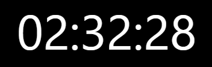
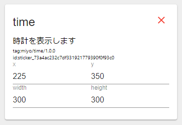
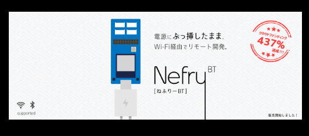
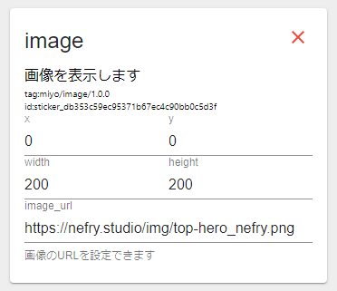
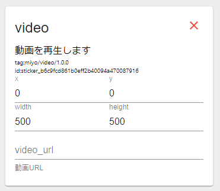
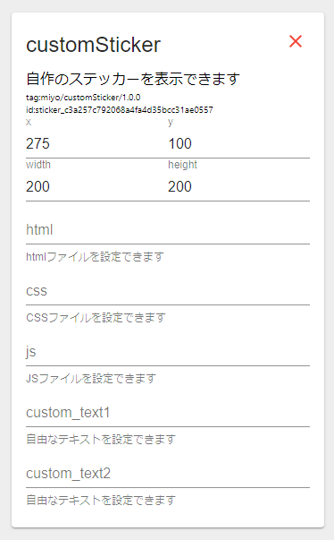

# 現在対応しているステッカー

## 時間

現在時間を表示できるステッカーです。

### ステッカー

### 設定欄

編集項目なし

## 画像

指定したURLの画像を表示できるステッカーです。

### ステッカー

### 設定欄

image\_url:画像のURLを設定します

## 動画

指定したURLの動画を表示できるステッカーです。

### ステッカー

### 設定欄

video\_url:動画のURLを指定します

## カスタムステッカー

自作したステッカーを表示させることができます。

### 設定欄

